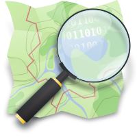

.. Descarga de datos de OSM documentation master file, created by
.. sphinx-quickstart on Mon Apr 11 19:08:45 2016.
.. You can adapt this file completely to your liking, but it should at least
.. contain the root `toctree` directive.

Descarga y utilización de datos de OpenStreetMap
================================================

Contenidos:

.. toctree::
   :numbered:
   :titlesonly:
   
   intro
   primitivas
   descargaosm
   josm
   qgis
   overpassapi
   osm2shp
   osm4j
   python
   javascript
   

Acerca de este documento
------------------------

Este documento ha sido creado en mayo de 2016 por Santiago Higuera, profesor de la Escuela Técnica Superior de Ingenieros de Caminos, Canales y Puertos de Madrid, en el Departamento de Matemáticas e Informática aplicadas a la Ingeniería Civil y Naval de la Universidad Politécnica de Madrid (España).

El objetivo es crear un manual para la utilización de los datos contenidos en la base de datos de OpenStreetMap.

Licencia
----------

Excepto donde quede reflejado de otra manera, la presente documentación
se halla bajo licencia `Creative Commons Reconocimiento Compartir Igual
<https://creativecommons.org/licenses/by-sa/4.0/deed.es_ES>`_

.. image:: _static/by-sa.png
   :width: 200px
   :alt: CC BY SA

..
.. Referencias
..

.. |Octave| raw:: html

   <a href="http://www.gnu.org/software/octave/" target="_blank">GNU Octave</a>

.. |EscuelaCaminos| raw:: html

   <a href="http://www.caminos.upm.es/" target="_blank">Escuela de Ingenieros de Caminos, Canales y Puertos de Madrid</a>

.. |Sphinx| raw:: html

   <a href='http://sphinx-doc.org/' target='_blank'>Sphinx</a>

.. |Github| raw:: html

   <a href='https://github.com/shiguera/OctaveIntro' target='_blank'>Github</a>

.. |shiguera| raw:: html

   <a href='mailto:santiago.higuera@upm.es'>santiago.higuera@upm.es</a>

Indices and tables
==================

* :ref:`genindex`
* :ref:`modindex`
* :ref:`search`

