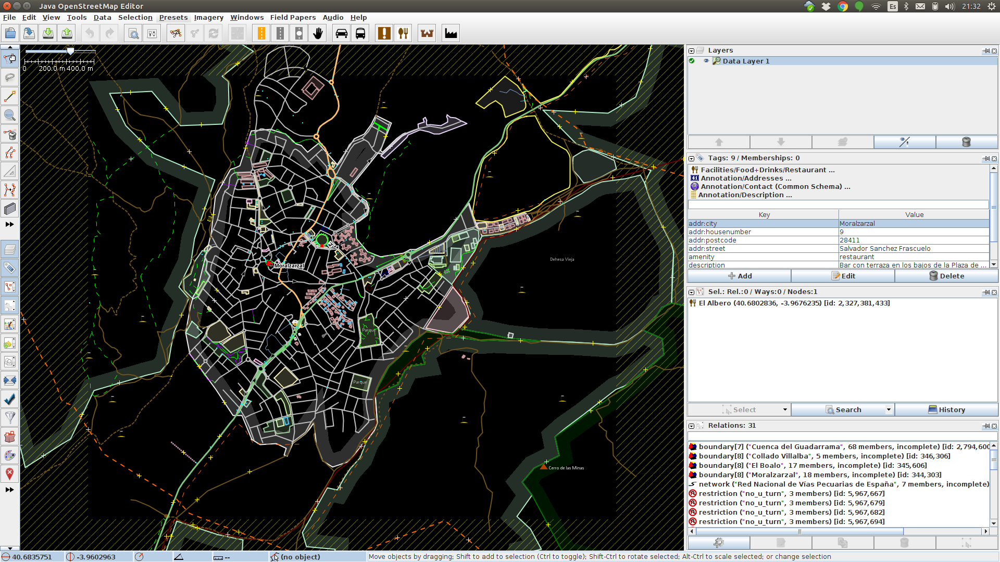
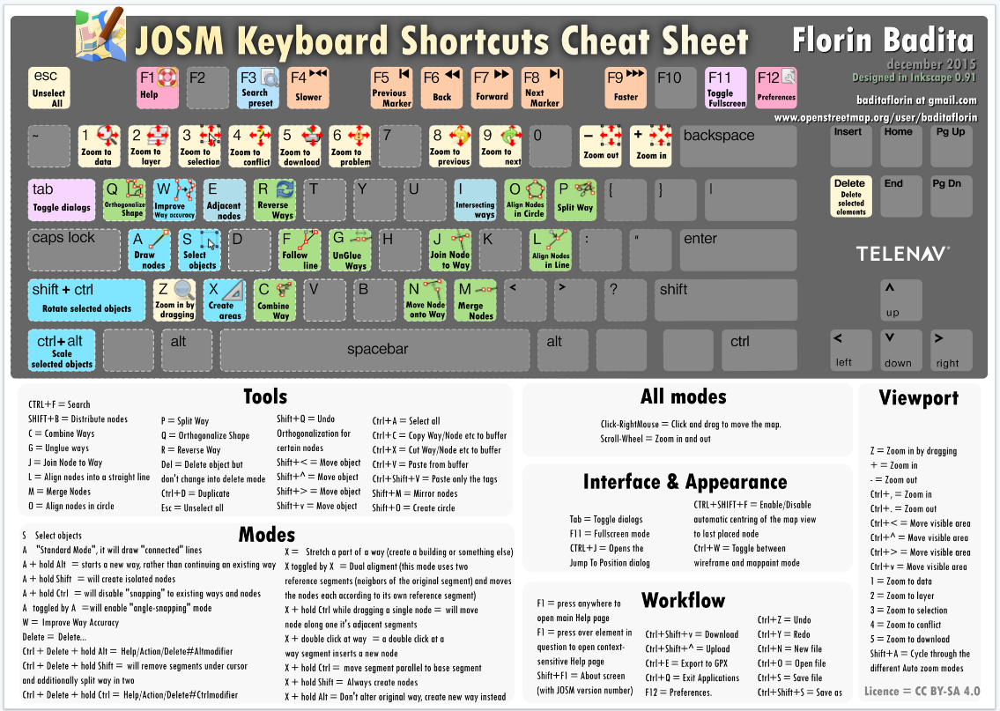
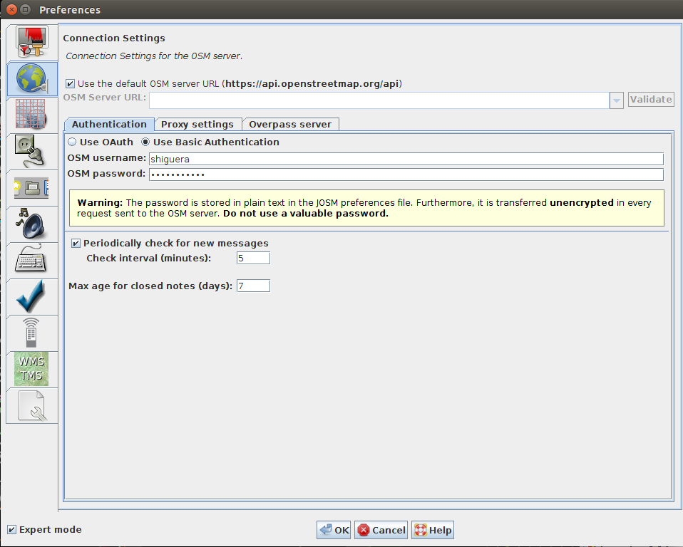
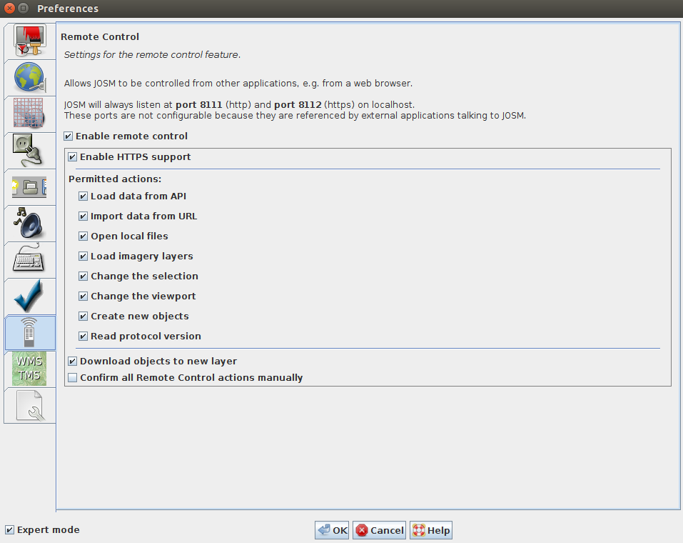
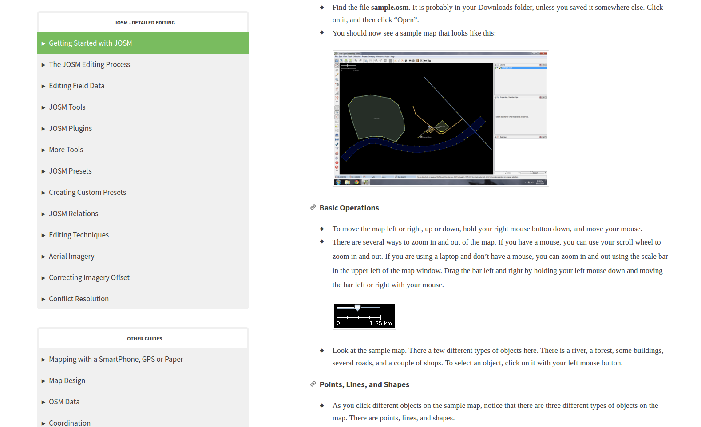

.. JOSM

JOSM
====

**JOSM** (*Java Openstreetmap Editor*) es el editor de referencia actualmente para visualizar, modificar y actualizar los datos de OpenStreetMap. Se trata de un programa de escritorio escrito en Java con el que se puede editar, en formato vectorial, la información de una determinada zona del mapa OSM, tanto las geometrías como las etiquetas. Fue desarrollado por Immanuel Scholz y actualmente está mantenido por Dirk Stöcker.

Existen versiones de JOSM para los diferentes sistemas operativos. Se pueden descargar desde el portal de JOSM:

`Portal de JOSM <https://josm.openstreetmap.de/>`_

Para su funcionamiento se requiere tener instalado en su ordenador Java 7.

A pesar de que tiene una curva de aprendizaje relativamente pronunciada, JOSM es muy popular entre los editores experimentados por su estabilidad y por las posibilidades que ofrece gracias en gran parte a sus componente externos, que extiende en gran manera sus capacidades de edición.

Existen otros editores de datos de OpenStreetMap, como *iD*, *Potlatch 2* o *Merkaator*. 

JOSM está traducido al español. Puedes ayudar a la comunidad en esta tarea desde `Launchpad <https://translations.launchpad.net/josm>`_.

El interface gráfico presenta a la izquierda una barra de herramientas y el mapa vectorial con la información de la zona descargada; en la parte derecha hay una serie de ventanas con información acerca de las capas descargadas, información temática del elemento seleccionado y otras. 

El programa es muy completo y permite multitud de opciones. Se pueden dibujar nuevos elementos (Nodes, Ways, Relations). Se pueden editar o modificar los existentes. Se pueden descargar zonas desde los servidores de OSM o también abrir ficheros *.osm* con la información que queremos editar.

La mayoria de las opciones permiten atajos de teclado, algunos de los cuales conviene memorizar para operar con velocidad. Puedes encontrar una buena chuleta con los atajos de teclado en el siguinete enlace:

`Atajos de teclado para JOSM <https://www.dropbox.com/s/e2km6hi88ovtk76/300_dpi%20JOSM%20Keyboard%20Layout.png?dl=0>`_

Configuración
-------------

Tras instalar el programa conviene hacer algunos ajustes en la ventana de configuración. Para acceder a las diferentes opciones de configuración hay que seleccionar la opción del menú *Edit->Preferences* o bien pulsando la tecla *F12*.

Usuario y contraseña
^^^^^^^^^^^^^^^^^^^^

Si queremos que las modificaciones que hagamos en los datos *OSM* se actualicen en los servidores de *OpenStreetMap*, tenemos que decirle al programa nuestro usuario registrado de *OSM*. 

Edición en remoto
^^^^^^^^^^^^^^^^^

Desde la ventana del mapa de *OpenStreetMap*, cuando elegimos la opción editar, nos da la opción de editar con *Id*, directamente en la Web, pero también podemos editar desde *JOSM*. Para ello tenemos que habilitar la opción de *control remoto* de *JOSM*. De esta manera, cuando solicitemos editar en el mapa de *ÔpenStreetMap*, la porción de mapa que estemos viendo en ese momento se descargará en *JOSM* y podremos editarla desde ahí

Complementos para JOSM (Plugins)
^^^^^^^^^^^^^^^^^^^^^^^^^^^^^^^^

Existen numerosos complementos desarrollados por colaboradores de *OSM* que agregan nuevas funcionalidades a *JOSM*. La forma más sencilla de instalar estas extensiones es desde el menú *Editar -> Preferencias -> Pestaña Complementos* y marcar aquellos componentes que desees agregar a JOSM. Puedes consultar la lista de complementos disponibles desde la propia ventana de configuración de *JOSM* o también visitando el siguiente enlace:

`JOSM Plugins <https://josm.openstreetmap.de/wiki/Plugins>`_

Material de aprendizaje
-----------------------

La web `learnosm.org <http://learnosm.org>`_ proporciona diversos manuales de iniciación y para usuarios avanzados que permiten aprender a utilizar el editor *JOSM*

Descarga de datos OSM desde JOSM
--------------------------------

*JOSM* ofrece varias opciones para descargar datos desde *OSM*, todas ellas accesibles desde la opción de menu *File*:

* Desde los servidores de OSM: Opción de menú *File -> Download from OSM*. Se puede seleccionar una región en el mapa, también se pueden indicar las coordenadas de las esquinas del bounding box que queremos descargar, se puede indicar que se descarguen los datos alrededor de un elemento identificado a través de *Nominatim* o también seleccionar una serie de tiles por su numeración.

* Mediante una query *Overpass API: Opción de menú *File -> Download from Overpass API*. Permite descargar los datos correspondientes a un petición en el lenguaje de la `Overpass API <http://overpass-api.de/>`_

* Objeto: Opción de menú *File -> Download object*. Se puede descargar un objeto concreto indicando el tipo de objeto (Node, Way o Relation) y su identificador *ID*.

* Notas: Opción de menú *File -> Download notes in current view*. Permite acceder a las notas que los usuarios de *OSM* hayan hecho en la parte del mapa que se visuaiza en el editor.

* Parent ways/Relations:  Opción de menú *File -> Download parent ways/relations*. Permite descargar los elementos *OSM* relativos al que esté seleccionado en el editor.

Además, *JOSM* permite abrir y editar cualquier fichero en formato *OSM* proveniente de descargas realizadas por otros procedimientos.

Exportación de datos desde JOSM
-------------------------------

Una vez editados los datos con *JOSM* podemos subirlos a los servidores de *OSM*, para que queden reflejadas las modificaciones que se hayan hecho, pero también podemos guardarlos en un fichero de disco para su edición posterior o su procesamiento con otros programas. 

La opción de menú para guardar la información en disco es *File -> Save as*. Se puede elegir entre varias opciones para guardar la información:

* GPX  
* GeojSON 
* Note files (*.osn*)
* OSM server files: *.osm, .osm.bz2, .osm.bz, .osm.gz*
* GeojSON proyectado: .proj.geojson

