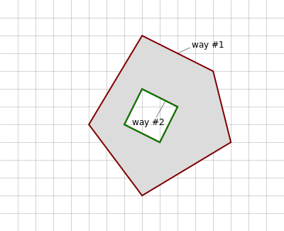

# primitivas

Estructura de la información en OSM
===================================

OSM es una base de datos de información geográfica. Los elementos o fenómenos existente en la realidad se modelizan mediante la incorporación de dos niveles de información:

* Información espacial: contiene la información relativa a la geometría y posición del fenómeno. Responde a la pregunta **¿Dónde?**

* Información temática: contiene las características y propiedades del fenómeno. Responde a la pregunta **¿Qué?**

En la base de datos de OSM a cada fenómeo de la realidad que se quiera modelar se le asigna una primitiva geométrica que le dota de la información espacial. Hay tres tipos de primitivas geométricas:

* Nodes: corresponden a la definición de un punto
* Ways: corresponden a la definición de una línea o de un polígono.
* Relations: combinan Nodes, Ways y otras Relations para definir geometrías o elementos complejos

La información temática se modela mediante etiquetas, *tags*, que son parejas de cadenas de texto en la forma *key-value*. Cada primitiva geométrica asociada a un fenómeno de la realidad llevará asociadas un número indeterminado de etiquetas que permitirán definir su información temática. Se pueden consultar las etiquetas más frecuentes en la página:

`http://wiki.openstreetmap.org/wiki/Map_Features <http://wiki.openstreetmap.org/wiki/Map_Features>`_

Node
----

Un Node representa una geometría puntual. Son los únicos elementos que tienen coordenadas.
Un ejemplo de un Node en formato *OSM*::

  <node id="25496583" lat="51.5173639" lon="-0.140043" version="1" changeset="203496"
        user="80n" uid="1238" visible="true" timestamp="2007-01-28T11:40:26Z"/>
    <tag k="highway" v="traffic_signals">
  </node>

Way
---

Representa una geometría de *Linestring*. Consta de una lista de Nodes identificados por su *Id* y una lista de etiquetas. Un ejemplo de Way en formato *OSM*::

  <way id="5090250" visible="true" timestamp="2009-01-19T19:07:25Z" version="8"
        changeset="816806" user="Blumpsy" uid="64226">
    <nd ref="822403"/>
    <nd ref="21533912"/>
    <nd ref="821601"/>
    <nd ref="21533910"/>
    <nd ref="135791608"/>
    <nd ref="333725784"/>
    <nd ref="333725781"/>
    <nd ref="823771"/>
    <tag k="highway" v="residential"/>
    <tag k="name" v="Clipstone Street"/>
    <tag k="oneway" v="yes"/>
  </way>

Si el último punto de un Way coincide con el primero, entonces se trata de una línea cerrada. Según el valor de las etiquetas puede tratarse de un area o simplemente deuna línea cerrada.

Relation
--------

Sirven para representar entidades más complejas. Consta de una lista de elementos *member* cada uno de los cuales tiene su *type*, su *id* y su *role*, y una lista de etiquetas. Las *Relations* aceptadas por los renderers se pueden consultar en:

`http://wiki.openstreetmap.org/wiki/Types_of_relation <http://wiki.openstreetmap.org/wiki/Types_of_relation>`_

Una *Relation* de uso común es la *multipolygon*, con sus *roles* *outer* e *inner* que permite definir edificios u otras superficies con huecos. Un ejemplo sería::

  <relation id="1">
    <tag k="type" v="multipolygon" />
    <member type="way" id="1" role="outer" />
    <member type="way" id="2" role="inner" />
  </relation>

Hay combinaciones más complejas de *multipolygon*. La *Relation* *multipolygon* se puede consultar en el siguiente enlace:

`http://wiki.openstreetmap.org/wiki/Relation:multipolygon <http://wiki.openstreetmap.org/wiki/Relation:multipolygon>`_

