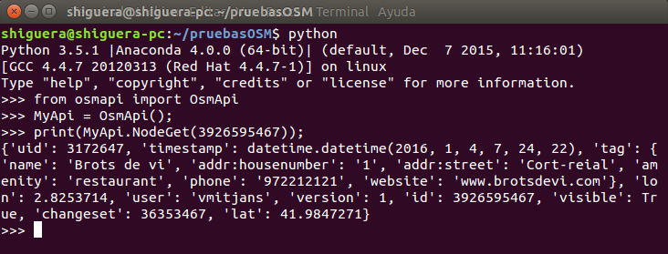

.. python

Python OsmApi
=============

Permite la descarga de datos desde la base de datos y también la actualización de la base de datos. Hay que respetar los códigos de conducta cuando se suben datos a OSM.

Para utilizar la librería tendremos que instalarla con::

  pip install osmapi

Hello World : node download
---------------------------

Un ejemplo en Python 3 para descargar la información de un Node del que conocemos su Id sería::

  >>> from osmapi import OsmApi
  >>> MyApi = OsmApi()
  >>> print(MyApi.NodeGet(3926595467));

El resultado sería el siguiente:

La documentación del API se puede consultar en:

`OsmApi <http://osmapi.metaodi.ch/>`_

